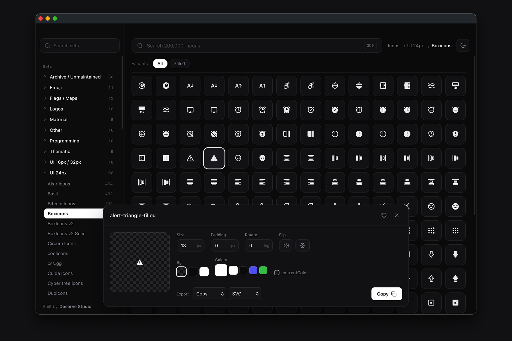

# Icônes — Desktop (中文增强版)

跨过 150+ 图标库、200,000+ 个图标，在 macOS 与 Windows 上原生运行的 [Iconify](https://iconify.design) 浏览器——支持中文搜索、库内 OneBox 风格筛选、跳转图标库、参数滑块等。

本仓库基于 [ensaktas1/icones-desktop](https://github.com/ensaktas1/icones-desktop) 二次开发，已与原版在功能与交互上发生显著分化。所有图标数据仍来自公开的 [Iconify API](https://iconify.design/docs/api/)。



## 下载

打开本仓库的 [**Releases**](https://github.com/mufanmu/icones-desktop-zh/releases/latest) 页面，在最新版本下下载对应平台的安装包（`Icones_0.1.x_universal.dmg` / `Icones_0.1.x_x64-setup.exe`）。应用内左下角自带版本检测，发现新版本时会提示并跳转下载页。

### macOS

打开本仓库的 [**Releases**](https://github.com/mufanmu/icones-desktop-zh/releases/latest) 拿到最新 `.dmg`，双击挂载后把 **Icônes** 拖进 **应用程序** 文件夹即可。

> 提供 **Universal 通用包**：同一个 `.dmg` 在 Intel 与 Apple Silicon 上都原生运行（最低 macOS 10.13）。新版本由 CI 在打 tag 时自动构建（见 [.github/workflows/release.yml](.github/workflows/release.yml)）；若某次 Releases 暂时只有 arm64 包，可自行 `npm run tauri:build:universal` 构建。
> 此版本未做 Apple Developer 签名，首次打开时需在 `系统设置 → 隐私与安全性` 点「仍要打开」放行一次，或终端执行：
> ```
> xattr -dr com.apple.quarantine "/Applications/Icônes.app"
> ```

### Windows

从 [**Releases**](https://github.com/mufanmu/icones-desktop-zh/releases/latest) 下载 `.exe` 安装包（`x64`，适用于 Intel/AMD 处理器，绝大多数 PC 均可；Windows on ARM 设备也可经系统模拟运行此包）。

> Windows 版由 CI 在打 tag 时与 macOS 同步自动构建，产出 `x64` 架构的 `.exe`。
> 未做代码签名，首次运行时 Windows SmartScreen 可能提示「已保护你的电脑 / 未知发布者」——点「更多信息」→「仍要运行」放行一次即可。

## 与原版相比的优化

### 1. 中文模糊搜索
- 内置本地词典 `public/zh-dict.json`（**5000+ 词条 / 6300+ 中文词**），覆盖人物、发型美妆、服饰穿搭、动物、食物饮品、家居、出行交通、运动、音乐艺术、办公学习、科技数码、医疗健康、购物金融、自然地理、建筑场所、娱乐节日、国家城市、军事安全、时间历法等数十个大类
- 新增 `src/lib/zhSearch.ts`：CJK 自动检测、词典懒加载、精确/正向/反向三级匹配回退（搜「箭头」能联想到左箭头/右上箭头/双箭头）
- 品牌词支持：搜 gpt/支付宝/抖音/微信 等直接展开对应图标
- 输入中文时按词条翻译成英文检索词，并发调用 Iconify `search` API 并集去重
- **库中无对应英文的词条自动跳过**：所有词典词条都经过 Iconify 全库 34,000+ 英文词段白名单验证，确保搜得出结果


### 2. 库内 OneBox 风格搜索
- 选中侧边栏图标库或在详情面板点击「跳转该库」时，搜索框内出现库 pill（仿 macOS Finder 的 tokenized input 模式）
- 点 pill 主体清空关键词回到该库浏览；点 pill 叉号或 Backspace 按段删两次回全局搜索
- pill 命中后搜索自动限制在该库内做本地实时过滤，零网络延迟
- 库内中文搜索同样支持（先翻译再过滤图标名）


### 3. 详情面板：库跳转
- 选中图标后，详情头部图标名下方新增「跳转该库」链接，点击直接切到对应图标库的浏览视图（应用内切换，非外链）

### 4. 详情面板：参数滑块 + 输入 Bug 修复
- 尺寸、Padding、旋转角三个参数都加了滑块，与输入框同步
- 默认尺寸由 18px 改为 24px
- 修复原版输入 Bug：18px → 输入 24 会变成 44（每键即 clamp 误导）；Padding/旋转 输入 80 会变成 080（前导零未清）。改用本地文本状态、blur 时夹紧、`stripLeadingZeros` 清前导零


### 5. 结果相关度重排
- 新增 `src/lib/rank.ts`：搜索结果按「精确词条 > 去变体精确 > 前缀 > 独立词段 > 子串」五档打分，叠加查询词位置加成
- 修复 Iconify 自身把 `video-camera` 排在纯 `camera` 前面、英文单词搜索无重排的问题；首屏永远是相关度最高的图标

### 6. 品牌词与生活化大类
- 内置 50+ 品牌词条：gpt/chatgpt/openai、alipay、wechat/wechat-pay、qq、tiktok/douyin、bilibili、taobao、jd、pinduoduo、meituan、eleme、didi、twitter/facebook/instagram、paypal、apple-pay、bitcoin/ethereum 等
- 生活化大类经 Iconify 全库词段白名单验证后入库：美女/发型/化妆/服饰/动物/食物/城市/节日/医疗/科技/金融等，搜「火锅」「春节」「扫地机器人」「伦敦」都有结果

### 7. 左下角版本检测
- 侧边栏左下角显示当前版本号；有新版本时显示「新版本 vX.Y.Z」按钮，点击跳转 GitHub Releases 下载页
- 由 GitHub API 拉取最新 tag 对比，失败时静默只显示版本号

### 8. 滚动懒加载（无限滚动）
- 去掉结果列表底部的「Load more」按钮，滚动到底部附近自动加载下一批（每批 200 个图标），底部保留 `Showing X of Y` 计数
- 底部 1px 哨兵 + `IntersectionObserver` 提前 800px 预加载；一批增量不足一屏时自动续载到填满视口，快速滚动不会重复加载
- 库内浏览/过滤为本地即时切片（零网络），全局搜索复用增量重查机制
- 切换库 / 搜索 / 变体过滤后自动滚动回顶，分页计数自动重置

## 词典维护脚本

词典由脚本可复现地生成/扩充，全部在 `scripts/` 下：

- `gen-dict.mjs`：反推 Iconify top 集合图标名 → 高频词段 → 用 `zh-root.json` 词根表翻译合并入库
- `build-whitelist.mjs`：拉取 Iconify 全库 236 集合图标名，构建 34,000+ 真实英文词段白名单
- `apply-map.mjs` / `fixup-map.mjs` / `backfill-from-root.mjs`：中文词 → 候选英文段映射，验证白名单后入库（库中无对应英文的词自动跳过）
- `audit-coverage.mjs` / `audit-report.mjs`：词典覆盖度盘点，生成未覆盖类目 HTML 报告


## Tech

- [Tauri 2](https://tauri.app) — 原生外壳（Rust）
- [React 19](https://react.dev) + [Vite](https://vite.dev) + TypeScript
- [`@iconify/react`](https://iconify.design/docs/icon-components/react/) 渲染图标
- [`@iconify/utils`](https://iconify.design/docs/libraries/utils/) 生成 SVG

## 开发

```bash
npm install
npm run tauri dev      # 桌面应用 dev 模式
npm run dev            # 仅前端，http://localhost:1420
```

## 构建

### macOS

```bash
# 仅本机架构
npm run tauri build              # 产物在 src-tauri/target/release/bundle

# Universal 通用包（Intel + Apple Silicon 合一，发布推荐）
rustup target add x86_64-apple-darwin aarch64-apple-darwin   # 首次装好两个目标
npm run tauri:build:universal    # 产物在 src-tauri/target/universal-apple-darwin/release/bundle
```

> macOS 交叉编译需要 `rustup`（Homebrew 版 rust 不带其它架构的标准库）。

### Windows

```bash
# 需先安装 Rust（rustup.rs）与 Visual Studio Build Tools 的「使用 C++ 的桌面开发」工作负载
npm run tauri:build:windows-x64      # Intel/AMD，产物在 src-tauri/target/x86_64-pc-windows-msvc/release/bundle
```

> 打 `v*` tag 会触发 [.github/workflows/release.yml](.github/workflows/release.yml) 自动构建 macOS Universal `.dmg` 与 Windows `.exe` 并发到 Releases（草稿）。

## 协议

- 应用代码遵循 MIT 协议 — 见 [LICENSE](LICENSE)
- 图标由 [Iconify](https://iconify.design) 提供，每个图标集保留各自协议（MIT、Apache-2.0、CC-BY 等），使用前请核对对应图标集
- 设计与初版实现来自 [ensaktas1/icones-desktop](https://github.com/ensaktas1/icones-desktop)
